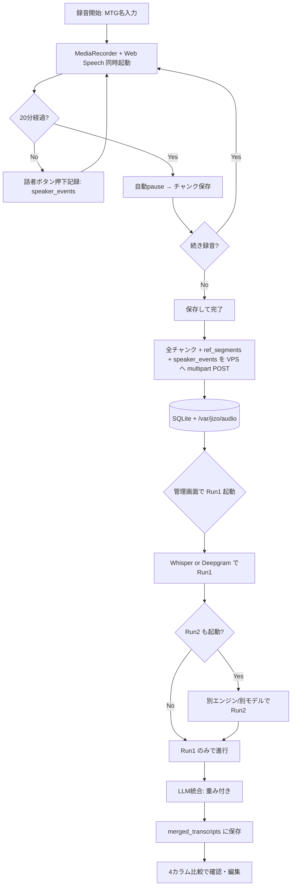
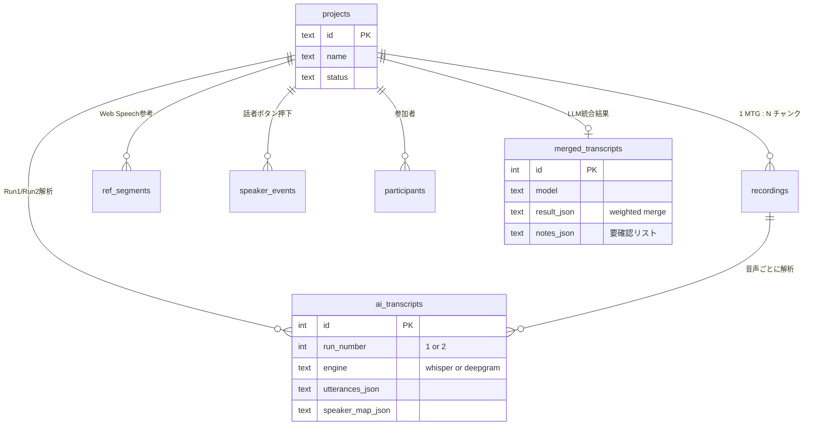

# AIボイスメモ — 開発コンセプト図解

## 1. プロダクトの核となる哲学

**「人間がリアルタイムで分かること」と「AIが後処理で分かること」を分業させる。**

| 軸           | 担当                          | 強み                       | 弱み                          |
|--------------|-------------------------------|----------------------------|-------------------------------|
| **誰が話したか** | 人間（録音中の話者ボタン押下）| 100%の正確さ・即時判断     | 押し忘れ・遅延がある          |
| **何を話したか** | AI（Whisper / Deepgram / WS）  | 大量データ・固有名詞推定   | 話者分離は苦手・誤字あり      |

→ 人間とAIが**それぞれ最も得意な部分だけ**を担当し、最後にLLMが**重み付きで統合**する。

---

## 2. システム全体構成図

```
┌────────────────────────────────────────────────────────────────────────┐
│                        ① モバイル端末（iPhone / Safari PWA）            │
│                                                                          │
│   ┌──────────────┐   ┌──────────────────┐   ┌──────────────────────┐   │
│   │ MediaRecorder│   │ Web Speech API    │   │ 話者ボタン            │   │
│   │ 32kbps webm  │   │ ストリーミング     │   │ 押下=話者切替の真理値 │   │
│   └──────┬───────┘   └─────────┬────────┘   └──────────┬───────────┘   │
│          │                     │                       │                │
│          └────────────┬────────┴───────────────────────┘                │
│                       ▼                                                  │
│           プロジェクト（=1MTG / 複数チャンク蓄積）                       │
│           ・録音ごとに最大20分→自動pause→続きは2本目チャンクへ          │
│           ・IndexedDB に自動退避（データロスト防止）                     │
│           ・STT無反応20秒でインラインバナー警告                          │
└────────────────────────┬─────────────────────────────────────────────────┘
                         │ HTTPS multipart：音声 + meta(JSON)
                         ▼
┌────────────────────────────────────────────────────────────────────────┐
│                  ② VPS（jizo-dev.com / FastAPI + SQLite）              │
│                                                                          │
│   ┌─────────────────────────────────────────────────────────────────┐  │
│   │ Nginx + HTTPS                                                   │  │
│   │  /ai-voice-memo/         モバイルPWA静的配信                    │  │
│   │  /ai-voice-memo/admin/   PC管理画面（Basic認証）                │  │
│   │  /api/                   FastAPI :8002                          │  │
│   └────────────────────────────┬────────────────────────────────────┘  │
│                                ▼                                         │
│   ┌─────────────────────────────────────────────────────────────────┐  │
│   │ FastAPI                                                         │  │
│   │  ・録音受け取り・保存                                           │  │
│   │  ・各Runを Whisper or Deepgram に振り分け（モデルから自動判定） │  │
│   │  ・LLM統合の重み付け計算とプロンプト構築                       │  │
│   └──┬──────────────┬────────────────────────┬───────────────────────┘  │
│      ▼              ▼                        ▼                          │
│  /var/jizo/    SQLite                  使用量集計テーブル               │
│   audio/      projects/recordings/      (api_usage)                    │
│   *.webm      ref_segments/             ← Deepgram公式集計と照合        │
│               participants/                                            │
│               ai_transcripts/                                          │
│               merged_transcripts                                       │
└──────┬───────────────────────────────────────────────────────────────────┘
       │
       ├──► ③-A OpenAI Whisper API（whisper-1）         同期・即completed
       │       Run1: language=ja 固定
       │       Run2: 自動判定＋プロンプトヒント（参加者名・カタカナ）
       │
       ├──► ③-B Deepgram API（nova-3 / nova-2）        話者分離あり
       │       Nova-3: keyterm パラメータ必須
       │       Nova-2: keywords パラメータ使用
       │
       └──► ④ Google Gemini API（gemini-2.5-flash / pro）
               OpenAI互換エンドポイント
               重み付き統合（後述）→ merged_transcripts に保存
                                ▼
┌────────────────────────────────────────────────────────────────────────┐
│              ⑤ PC管理画面（Basic認証 / jizo-dev.com/.../admin/）        │
│                                                                          │
│   ・MTG一覧 / 詳細 / MTG名編集 / 削除                                   │
│   ・Run1 / Run2 の解析（モデル選択モーダル）                            │
│   ・LLM統合の **重み3軸スライダー**（WS:Run1:Run2 = 合計10）            │
│   ・4カラム比較表（LLM / WS / Run1 / Run2）タイムライン軸2秒窓マージ   │
│   ・音声ダウンロード / Deepgram公式使用量取得                           │
└────────────────────────────────────────────────────────────────────────┘
```

---

## 3. データフロー（録音から最終トランスクリプトまで）



---

## 4. LLM統合のゼロ欠落・時系列整流アーキテクチャ（最重要・独自設計）

### 4.1 設計思想

「LLMに行構成を任せる設計」は破綻する。LLMは指示に反して行を圧縮・幻覚を混入させ、末尾はトークン上限で truncation する。

→ **行構成は決定論で確定し、LLM の役割は行内テキストの整流のみに限定**する。
→ 構造に「ゼロ欠落の保証」「時系列順の保証」「LLM 障害でも結果が返る保証」を組み込む。

### 4.2 5フェーズアーキテクチャ

```
[Phase 1] 主軸選定（決定論）
─────────────────────────────────────────
  運用デフォルトは `fixed` で Run1 (Whisper) を固定主軸とする
  （日本語精度の高さと音声分割の安定性から）
  自動選定にも切替可能: rows_x_log_chars / rows_only / chars_only
  例) Run1=139行 が主軸として確定

[Phase 2] 行構築（主軸 + オーファン挿入）
─────────────────────────────────────────
  主軸の各行に他2ソースの最近傍候補を ±2秒窓で添付
  主軸どの行とも窓外、かつ広域類似度 < 0.4 の他ソース発話は
    「オーファン」として時系列で挿入
  同一ソース内、500ms 以内の隣接オーファンを連結
  → 行数 (M + K) はここで確定（以降変動禁止）
  例) 主軸139行 + オーファン2行 = 141行

[Phase 3] 話者解決（決定論・既存ロジック）
─────────────────────────────────────────
  優先度チェーン:
    1. 押下イベント ±2秒以内
    2. 直前押下継承
    3. WS speaker_idx ±4秒
    4. 「未設定」 + 末尾に【要確認:話者】

[Phase 4] チャンク分割 LLM 整流（並列）
─────────────────────────────────────────
  全行を chunk_size（デフォルト25）行ずつ分割
  各チャンクに前後2行を「文脈（編集対象外）」として付与
  最大 parallel（デフォルト3）並列で LLM 呼出
  
  LLM の仕事は厳格に3つだけ:
    ① 主軸が拾い損ねた単語を他候補から補完
    ② 主軸内で明らかに順序が崩れた語句の修正
    ③ 句読点・スペースの整形
  禁止: 行追加/削除/統合/分割/並べ替え、候補に無い語句生成、意味書換え
  
  出力形式は JSONL（1行=1JSON）→ truncation 耐性が高い

[Phase 5] 強制整合（決定論）
─────────────────────────────────────────
  チャンクごとに:
    LLM 失敗 or 行数不一致 → そのチャンク全行を主軸生テキストで埋める
    各行で「候補に無い4字以上連続部分文字列」を検出 → 幻覚と判定
      → 主軸生テキストで上書き、note='要確認:LLM過剰補填可能性'

  最終 result_json = [{ts, speaker, text, note, sources?}]
```

### 4.3 設計が保証する3性質

**ゼロ欠落の保証根拠**
- 主軸全行は Phase 1 で確定、Phase 5 のフォールバックで Phase 4 後も保持
- 他ソース独自発話は Phase 2 のオーファン挿入で救済
- LLM が壊れても結果は必ず返る（決定論フォールバック）

**時系列順の保証根拠**
- 主軸1本で時系列が混線しない
- オーファンは ms 値で挿入位置確定
- LLM は行内テキストのみ編集、行自体の順番を変えられない

**LLM 障害でも結果が返る根拠**
- チャンクごとの API 失敗・パース失敗・行数不一致をすべて検知
- 失敗時は主軸生テキスト直採用（merge_settings の `retry_per_chunk` でリトライも可能）
- ユーザーには `fallback_chunks` をレスポンスに返して状況を可視化

### 4.4 重みスライダー（補完優先度ヒント）

旧設計で「主軸選定の重み」だった `w_ws:w_run1:w_run2` は、新設計では**主軸選定には使われない**（自動アルゴリズム）。代わりに **LLM への補完優先度ヒント** として渡される:

```
## 補完優先度（同等候補から1つ選ぶ際の参考）
WebSpeech : Run1(Whisper) : Run2(Deepgram) = 1 : 7 : 2
```

- 同等の候補が複数ある場合、重みの高いソースを LLM が優先する
- 重み 0 でも候補からは除外されない（ゼロ欠落要件のため）
- スライダー UI は localStorage に保存・MTGをまたいで継続
- **運用デフォルト 1:7:2**：主軸が Run1（Whisper）固定なので、補完優先度も Run1 を高く設定する

### 4.5 LLM統合詳細設定（管理画面）

```
┌──────────────────────────────────────┐
│ ⚙ LLM統合詳細設定                    │
├──────────────────────────────────────┤
│ 主軸選定: [行数 × log(文字数)（推奨） ▼]│
│ デフォルトモデル: [Gemini 2.5 Flash ▼]  │
│ ┌──────────┬──────────┐                │
│ │チャンク25│並列    3 │                │
│ │統合窓2000│類似度0.4 │                │
│ │tokens 8192│リトライ1│                │
│ └──────────┴──────────┘                │
│                  [デフォルト] [保存]    │
└──────────────────────────────────────┘
```

- DB `merge_settings` テーブルに保存（プロジェクト共通設定）
- `PUT /api/settings/merge` で更新、範囲外は自動クランプ
- 旧重みスライダーは別セクションに維持（補完優先度ヒント用）

---

## 5. データモデル概念図（SQLite）



---

## 6. 設計上の重要な制約

| 制約                  | 理由                                       |
|------------------------|--------------------------------------------|
| `createSTT()` のみ差し替え可 | Web Speech依存を将来切り替えても他に影響しない |
| 録音20分/チャンク       | Whisper API ファイルサイズ25MB制限          |
| HTTPS必須              | Web Speech APIとマイクアクセスの要件        |
| Basic認証（管理画面のみ）| モバイル側は誰でもアップロード可（軽い運用） |
| APIキーは全部VPS側       | クライアント漏洩防止                       |
| グラデーション全面禁止 | ユーザー指定の絶対ルール                   |

---

## 7. 拡張ロードマップ（未着手）

```
[現在地]                                    [次フェーズ]
  ┌─────────────┐                           ┌──────────────┐
  │ 録音 →      │                           │ 要約・ToDo    │
  │ 文字起こし → │  ────────────────────►  │ 抽出・Q&A     │
  │ 重み統合    │                           │ (Claude API) │
  └─────────────┘                           └──────────────┘
                                                    │
                                                    ▼
                                            ┌──────────────┐
                                            │ PII保護       │
                                            │ (Presidio +  │
                                            │  GiNZA)      │
                                            └──────────────┘
                                                    │
                                                    ▼
                                            ┌──────────────┐
                                            │ テンプレート  │
                                            │ (会議/インタ  │
                                            │  ビュー/講義) │
                                            └──────────────┘
```
