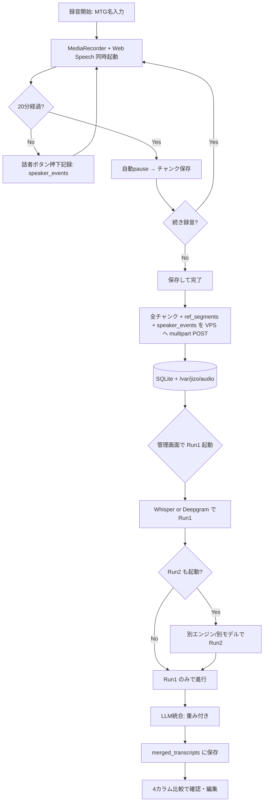
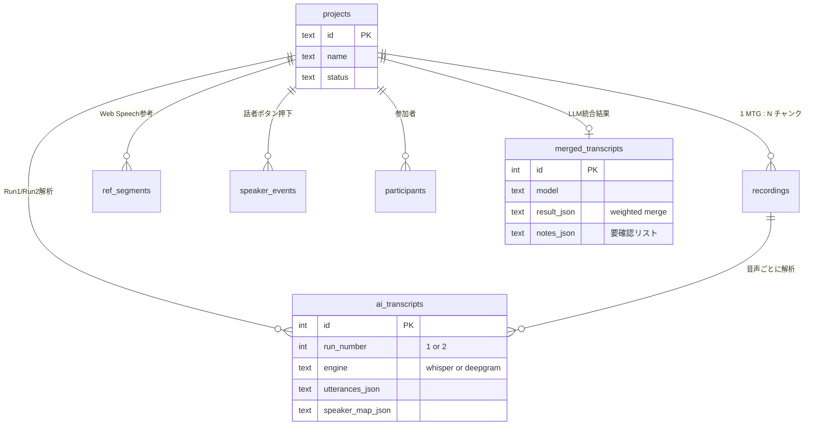

# AIボイスメモ — 開発コンセプト図解

## 1. プロダクトの核となる哲学

**「人間がリアルタイムで分かること」と「AIが後処理で分かること」を分業させる。**

| 軸           | 担当                          | 強み                       | 弱み                          |
|--------------|-------------------------------|----------------------------|-------------------------------|
| **誰が話したか** | 人間（録音中の話者ボタン押下）| 100%の正確さ・即時判断     | 押し忘れ・遅延がある          |
| **何を話したか** | AI（Whisper / Deepgram / WS）  | 大量データ・固有名詞推定   | 話者分離は苦手・誤字あり      |

→ 人間とAIが**それぞれ最も得意な部分だけ**を担当し、最後にLLMが**重み付きで統合**する。

---

## 2. システム全体構成図

```
┌────────────────────────────────────────────────────────────────────────┐
│                        ① モバイル端末（iPhone / Safari PWA）            │
│                                                                          │
│   ┌──────────────┐   ┌──────────────────┐   ┌──────────────────────┐   │
│   │ MediaRecorder│   │ Web Speech API    │   │ 話者ボタン            │   │
│   │ 32kbps webm  │   │ ストリーミング     │   │ 押下=話者切替の真理値 │   │
│   └──────┬───────┘   └─────────┬────────┘   └──────────┬───────────┘   │
│          │                     │                       │                │
│          └────────────┬────────┴───────────────────────┘                │
│                       ▼                                                  │
│           プロジェクト（=1MTG / 複数チャンク蓄積）                       │
│           ・録音ごとに最大20分→自動pause→続きは2本目チャンクへ          │
│           ・IndexedDB に自動退避（データロスト防止）                     │
│           ・STT無反応20秒でインラインバナー警告                          │
└────────────────────────┬─────────────────────────────────────────────────┘
                         │ HTTPS multipart：音声 + meta(JSON)
                         ▼
┌────────────────────────────────────────────────────────────────────────┐
│                  ② VPS（jizo-dev.com / FastAPI + SQLite）              │
│                                                                          │
│   ┌─────────────────────────────────────────────────────────────────┐  │
│   │ Nginx + HTTPS                                                   │  │
│   │  /ai-voice-memo/         モバイルPWA静的配信                    │  │
│   │  /ai-voice-memo/admin/   PC管理画面（Basic認証）                │  │
│   │  /api/                   FastAPI :8002                          │  │
│   └────────────────────────────┬────────────────────────────────────┘  │
│                                ▼                                         │
│   ┌─────────────────────────────────────────────────────────────────┐  │
│   │ FastAPI                                                         │  │
│   │  ・録音受け取り・保存                                           │  │
│   │  ・各Runを Whisper or Deepgram に振り分け（モデルから自動判定） │  │
│   │  ・LLM統合の重み付け計算とプロンプト構築                       │  │
│   └──┬──────────────┬────────────────────────┬───────────────────────┘  │
│      ▼              ▼                        ▼                          │
│  /var/jizo/    SQLite                  使用量集計テーブル               │
│   audio/      projects/recordings/      (api_usage)                    │
│   *.webm      ref_segments/             ← Deepgram公式集計と照合        │
│               participants/                                            │
│               ai_transcripts/                                          │
│               merged_transcripts                                       │
└──────┬───────────────────────────────────────────────────────────────────┘
       │
       ├──► ③-A OpenAI Whisper API（whisper-1）         同期・即completed
       │       Run1: language=ja 固定
       │       Run2: 自動判定＋プロンプトヒント（参加者名・カタカナ）
       │
       ├──► ③-B Deepgram API（nova-3 / nova-2）        話者分離あり
       │       Nova-3: keyterm パラメータ必須
       │       Nova-2: keywords パラメータ使用
       │
       └──► ④ Google Gemini API（gemini-2.5-flash / pro）
               OpenAI互換エンドポイント
               重み付き統合（後述）→ merged_transcripts に保存
                                ▼
┌────────────────────────────────────────────────────────────────────────┐
│              ⑤ PC管理画面（Basic認証 / jizo-dev.com/.../admin/）        │
│                                                                          │
│   ・MTG一覧 / 詳細 / MTG名編集 / 削除                                   │
│   ・Run1 / Run2 の解析（モデル選択モーダル）                            │
│   ・LLM統合の **重み3軸スライダー**（WS:Run1:Run2 = 合計10）            │
│   ・4カラム比較表（LLM / WS / Run1 / Run2）タイムライン軸2秒窓マージ   │
│   ・音声ダウンロード / Deepgram公式使用量取得                           │
└────────────────────────────────────────────────────────────────────────┘
```

---

## 3. データフロー（録音から最終トランスクリプトまで）



---

## 4. LLM統合の重み付きアーキテクチャ（最重要・独自設計）

### 4.1 設計思想

従来：「LLMに3ソース全部投げて整形してもらう」
→ LLMが**勝手にマージ・省略・1ソースに偏る**問題が発生

新設計：**LLMの自由度を構造的に制限する**
→ アルゴリズム側で「行構造」「話者」を確定 → LLMは「テキスト選択のみ」に集中

### 4.2 統合アルゴリズム

```
[ステップ1] 重みから骨組みソースを選定
─────────────────────────────────────────
  user weights: WS=2, Run1=4, Run2=4
  → 同点時の優先度: run2 > run1 > ws
  → 骨組み: Run2

[ステップ2] 骨組みの全セグメントを行に展開
─────────────────────────────────────────
  Run2 が 30セグメント → 出力も30行（固定）

[ステップ3] 各行に他ソースを「候補」として添える
─────────────────────────────────────────
  各行のタイムスタンプから ±2秒以内の最近傍を採用
  
  行01 [00:02] WS="こんにちは"   Run1="こんにちは"   Run2="こんにちは"
  行02 [00:23] WS="ＤＳＲ"        Run1="DSL"         Run2="DSR について"
  行03 [00:45] WS=(なし)          Run1="今日のアジェ" Run2="今日のアジェンダは"

[ステップ4] 話者をアルゴリズムで決定（LLMに任せない）
─────────────────────────────────────────
  優先度チェーン:
    1. 押下イベント ±2秒以内 → そのspeaker_idx
    2. それ以前の最新押下を継承
    3. WS ref_segments の speaker_idx
    4. どれも無い → "未設定" + 【要確認:話者】

[ステップ5] LLMに構造化テーブルと重みを渡す
─────────────────────────────────────────
  「行を追加・削除・マージするな。
   各行のtextを、重み比 2:4:4 に従って3候補から選ぶ・合成せよ。」
  
  LLMの仕事は「行ごとのテキスト合成」だけ → 暴走しない
```

### 4.3 重み設定UI（管理画面）

```
┌────────────────────────────────────────┐
│ LLM統合の重み付け（合計10）             │
│                                          │
│   WS  2  :  Run1  4  :  Run2  4         │
│                                          │
│ Web Speech ●──────                  2   │
│ Run1       ────●──                  4   │
│ Run2       ────●──                  4   │
│                                          │
│ [Run2重視 1:2:7] [均等 2:4:4] [WS重視 7:2:1]│
└────────────────────────────────────────┘
```

- スライダー1本を動かすと他2本が比例配分で自動調整（合計10維持）
- 重み 0 のソースは LLM への入力から完全に除外
- 設定は localStorage に保存・MTGをまたいで継続

---

## 5. データモデル概念図（SQLite）



---

## 6. 設計上の重要な制約

| 制約                  | 理由                                       |
|------------------------|--------------------------------------------|
| `createSTT()` のみ差し替え可 | Web Speech依存を将来切り替えても他に影響しない |
| 録音20分/チャンク       | Whisper API ファイルサイズ25MB制限          |
| HTTPS必須              | Web Speech APIとマイクアクセスの要件        |
| Basic認証（管理画面のみ）| モバイル側は誰でもアップロード可（軽い運用） |
| APIキーは全部VPS側       | クライアント漏洩防止                       |
| グラデーション全面禁止 | ユーザー指定の絶対ルール                   |

---

## 7. 拡張ロードマップ（未着手）

```
[現在地]                                    [次フェーズ]
  ┌─────────────┐                           ┌──────────────┐
  │ 録音 →      │                           │ 要約・ToDo    │
  │ 文字起こし → │  ────────────────────►  │ 抽出・Q&A     │
  │ 重み統合    │                           │ (Claude API) │
  └─────────────┘                           └──────────────┘
                                                    │
                                                    ▼
                                            ┌──────────────┐
                                            │ PII保護       │
                                            │ (Presidio +  │
                                            │  GiNZA)      │
                                            └──────────────┘
                                                    │
                                                    ▼
                                            ┌──────────────┐
                                            │ テンプレート  │
                                            │ (会議/インタ  │
                                            │  ビュー/講義) │
                                            └──────────────┘
```
